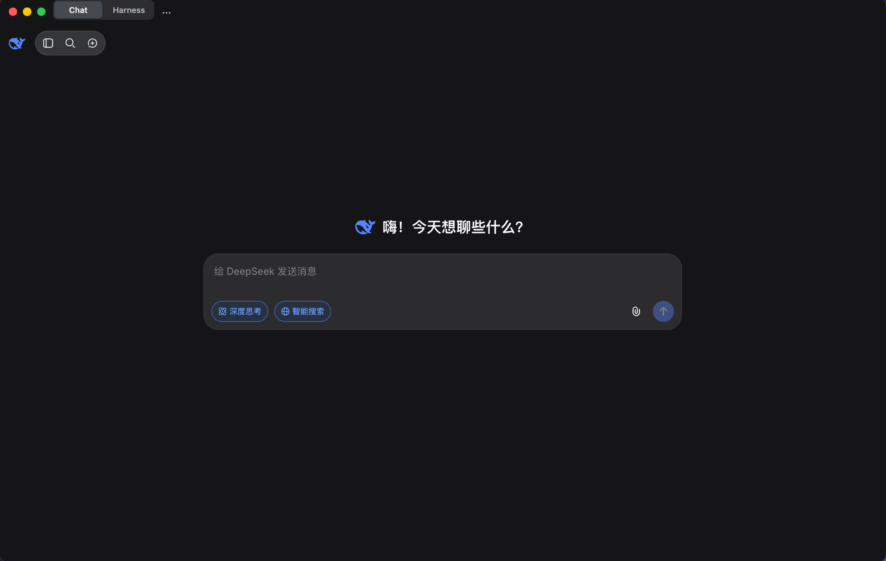
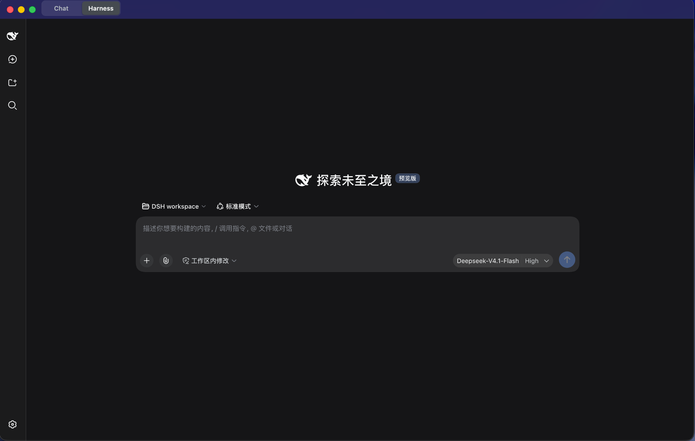

# DeepSeek Desktop

[English](README.md) | 中文

由社区维护的一体化桌面体验，整合官方 DeepSeek Chat、本地 Chat Memory 与 DeepSeek Harness。

**非官方项目。** 本项目是社区维护的非官方 DeepSeek Desktop 项目，与 DeepSeek AI 无官方隶属、授权、赞助或背书关系，并非 DeepSeek AI 官方产品。本项目基于 DeepSeek 及社区开源组件继续开发与整合。相关商标、上游项目名称及版权归各自权利人所有。开源许可证允许按其条款使用代码，不代表官方合作或认可。

## 预览

### Chat



### Harness



当前 macOS Apple Silicon 已验收构建。`assets/screenshots/` 下的 `*-mode-home.png` 为继承自上游的示意图，不代表本构建。

## 功能

- 中英文桌面控件，以及可保留状态的 Chat 和 Harness 视图。
- 官方 DeepSeek Chat，使用独立的持久化浏览器分区。
- 本地 Chat Memory 与 Memory Manager，支持搜索、添加、编辑、删除、置顶及 JSON 导入/导出。
- 官方 DeepSeek Harness WebUI，不分叉其已发布的前端。
- 托管 Harness 安装、启动、健康检查与手动检查更新。
- Chat 与 Harness 结果的桌面通知，以及报告 Harness 事务真实阶段的更新卡片。
- 保留当前与上一程序版本，支持回滚、中断操作恢复和进程归属检查。
- 打包应用自带运行时能力，用户无需预装 Node.js 或 npm。

## 架构概览

| 组件 | 职责 |
| --- | --- |
| Desktop 运行时 | 使用 Electron 的 Node 模式与固定版本 npm 11.12.1 安装并监督 Harness。 |
| Chat | 官方网站，运行在独立的持久化 Electron 分区中。 |
| 本地 Memory | 运行在 Chat 分区中的 DeepSeek++ Memory 专用修改版扩展。 |
| Harness | 官方 `@deepseek-ai/dsh`，独立于 Desktop 发布周期安装。 |
| 用户数据 | Chat/Memory 存储和 Harness 设置/会话与托管程序版本分开保存。 |

打包应用包含安装与管理官方 Harness 所需的运行时能力，**不捆绑固定的 Harness 依赖树**。源码开发使用仓库中的 Harness 实现；打包应用下载官方 npm 包。实现细节见[桌面指南](apps/desktop/README.md)。

## DeepSeek Chat

Chat 打开 [chat.deepseek.com](https://chat.deepseek.com/)，使用网站自身的登录流程。网站访问、认证、网络连接和服务政策由 DeepSeek 控制。Chat 登录不会为 Harness 提供 API 凭据。

## 本地 Memory

Memory 记录保存在本地 Chat 分区。新对话会把选中的相关记录与 Memory 保存协议加入发往 Chat 的提示词；模型可通过该协议追加记录。已有记录通过 **Memory** 菜单管理。清除 Chat 数据或迁移 profile 前，请先导出 JSON。

本地存储不意味着 Memory 完全离线：被加入提示词的选中记录会随 Chat 请求发送给 DeepSeek。导出的 JSON 包含相应记录，应视为私有数据。Desktop 不承诺 Memory 静态加密。**清除 Chat 数据**也会删除本地 Memory 和内嵌登录状态，但不会删除 DeepSeek 服务端的对话。

## Harness

Harness 提供官方 WebUI 以及工作区、智能体和工具能力。请独立于 Chat 配置所需的模型提供方凭据。Harness 按其进程权限和已配置策略运行本地工具；使用前应检查命令与工作区访问权限。

## Managed Harness Runtime

首次运行打包应用时，选择 Harness 并点击**安装 Harness**。Desktop 通过固定版本 npm 从官方 registry 下载官方 `@deepseek-ai/dsh`，验证安装完整性与健康状态后，将该版本设为当前版本。安装和更新需要联网。正常启动使用已安装版本，不安排自动更新检查。

## 更新与回滚

通过 **Harness** 菜单检查更新，并明确执行官方 `latest` 的安装。不会用 `next` 等预发布标签代替 `latest`。新版本通过健康检查后才会成为当前版本，失败时保留原有当前版本。Desktop 保留当前与上一程序版本。**高级 → 回滚**要求存在保留的上一版本，且该版本通过健康检查。

安装、更新或重装期间，窗口内会显示一张卡片。它报告运行时实际到达的阶段——准备、安装、校验，或对候选版本的健康检查——不显示推测的百分比，同时下方的 Chat 与 Harness 仍可继续使用。在事务尚未向 staging 目录之外写入任何内容时，卡片提供取消；一旦候选版本进入晋升流程，取消会被拒绝，此时控件保持可点击并说明原因。完成后的卡片只在当前使用版本确实发生变化时给出原版本号，因此重装正在运行的版本不会被显示为升级；卡片同时说明新版本在 Harness 重启后生效。

恢复机制处理被中断的程序事务。当前 Harness 回滚只恢复选定的 Harness 二进制版本，不会回滚或恢复 `~/.dsh` 下由 Harness 管理的本地数据。如果新版 Harness 迁移或修改了本地数据格式，回滚后旧版 Harness 可能无法读取已经升级的状态。在上游 schema 与 migration 行为得到验证之前，DeepSeek Desktop 不保证回滚后的跨版本数据兼容性。回滚不是备份；切换版本前请备份重要的 Harness 数据。

## 安装

人工验收覆盖 macOS Apple Silicon 开发构建。本衍生项目尚无公开稳定版本，也未完成签名与公证。仓库包含 Windows x64 打包配置，但本次验收不认证 Windows 构建。Linux Desktop 安装包不是当前发布目标。

### 打包应用用户

打包后的 DeepSeek Desktop 不要求预装 Node.js、npm、pnpm 或 Homebrew，也不要求全局安装 `dsh`。打包应用通过 Electron 的 Node 模式及随包提供的固定版本 npm 运行时运行；首次使用 Harness 时，由 Managed Runtime 安装官方 `@deepseek-ai/dsh` 包。Harness 仍需所配置模型提供方要求的账号或 API 凭据。

### 源码开发要求

Node.js `^22.19.0` 或 `>=24.0.0` 与 pnpm `11.7.0` 的要求仅适用于从源码开发、自行构建和自行打包，不是使用打包应用的前置条件。

<a id="run"></a><a id="run-from-source"></a>

```sh
pnpm install
pnpm run dev:desktop
```

生成本地未封装应用目录：

```sh
pnpm run package:desktop
```

打包命令准备固定版本 npm 并构建 Desktop 应用，不发布 Release。打包细节见[桌面指南](apps/desktop/README.md)。

## 基本使用

1. 打开 Desktop，在标题栏选择 **Chat** 或 **Harness**。
2. 通过官方 Chat 页面登录，或安装 Harness 并单独配置模型提供方。
3. 打开 **Memory → 管理 Memory** 查看或添加本地记录；使用 JSON 导出进行备份。
4. 使用 Harness 菜单手动检查更新、重启或执行符合条件的回滚。
5. macOS 上 Command+W 隐藏窗口，重新激活应用可恢复；Command+Q 退出 Desktop 及其拥有的托管进程。

## 数据、隐私与运行时隔离

Chat Cookie 和本地 Memory 属于 Chat 分区。Harness 使用自己的数据目录，通常为 `~/.dsh`，也可显式配置 `DSH_HOME`；现有 Harness 配置可能与单独启动的 CLI 共享。托管程序版本、暂存目录和 npm 缓存位于 Desktop 用户数据目录中。更新程序文件不会主动迁移或删除 Harness 用户数据。

Chat Memory 不会注入 Harness 提示词。进程归属检查防止过期或不匹配的记录授权终止无关 `dsh`。这是程序/运行时隔离，**不是完整的操作系统级沙箱**。已配置的 Harness 及其工具可以访问本地资源。报告问题时不要附带 Cookie、API 密钥、私有 Memory 或会话导出，详见 [SECURITY.md](SECURITY.md)。

## 上游与致谢

本项目基于 **@zcx960** 开源的 [deepseek-desktop](https://github.com/zcx960/deepseek-desktop) 继续开发，感谢原作者提供 Desktop 基础实现。本衍生项目增加了本地 Chat Memory、Managed Harness 安装、更新/回滚、恢复及验收工作，并保留上游中文化与桌面整合改进。

同时感谢 [DeepSeek AI / DeepSeek Harness](https://github.com/deepseek-ai/deepseek-harness)、[DeepSeek++ / deepseek-pp](https://github.com/zhu1090093659/deepseek-pp)，以及 Cordis、Electron、Node.js、npm 和其他依赖的贡献者。[ACKNOWLEDGEMENTS.md](ACKNOWLEDGEMENTS.md) 记录使用的 revision 和许可证位置。致谢不代表联合开发、上游作者参与或认可本衍生项目。

## 开发状态

工程封箱：**READY FOR HUMAN ACCEPTANCE**。**Human Acceptance：PASS**，由项目所有者人工确认 macOS 窗口生命周期、布局、Chat、本地 Memory、Memory Manager 及添加 Memory。公开发布准备进行中，本次验收阶段的产品开发已完成。

真实 GUI 更新到回滚流程仍属于上游后续验证项：封箱时官方 `latest` 与已安装版本相同。打包运行时更新/回滚安全检查已通过，但不可执行的 GUI 流程不记为已执行。用户的验收报告也未单独确认导入/导出 GUI 操作记录。

## 已知限制

Harness 首次安装依赖 registry 可用性，可能需要数分钟。未来官方版本可能改变启动、认证或存储行为。Desktop 的主题入口作用于 Desktop shell 与 Chat。官方 Harness WebUI 保留自身的 `light`／`dark`／`system` 设置，不能可靠跟随 Desktop 主题入口；这是已确认并接受的架构边界：当前没有可稳定依赖的官方主题控制接口，强行统一需要耦合 Harness 内部实现或 fork 官方前端。若未来官方版本提供稳定的外部主题控制接口，可再评估统一入口。Chat 内嵌体验可能受网站政策、WAF 或认证来源变化影响。本项目不提供官方服务授权，也不宣称稳定发布或跨平台认证。

## 许可证

现有 [MIT License](LICENSE) 及其上游版权声明继续适用于 MIT 覆盖的代码。Memory 衍生实现采用 **Apache-2.0**，原生 Landlock 组件采用 **BSD-3-Clause**，打包的 npm 采用 **Artistic-2.0**，其依赖遵循各自条款。详见 [THIRD_PARTY_NOTICES.md](THIRD_PARTY_NOTICES.md) 和 [ACKNOWLEDGEMENTS.md](ACKNOWLEDGEMENTS.md)。根 MIT 文件不改变这些组件的许可证。

## 贡献

提出修改前请阅读 [CONTRIBUTING.md](CONTRIBUTING.md)。产品修复应保持聚焦，保留上游署名，并仅使用可丢弃数据测试。发布 Desktop 二进制、tag 或 Release 需要维护者另行决定。
